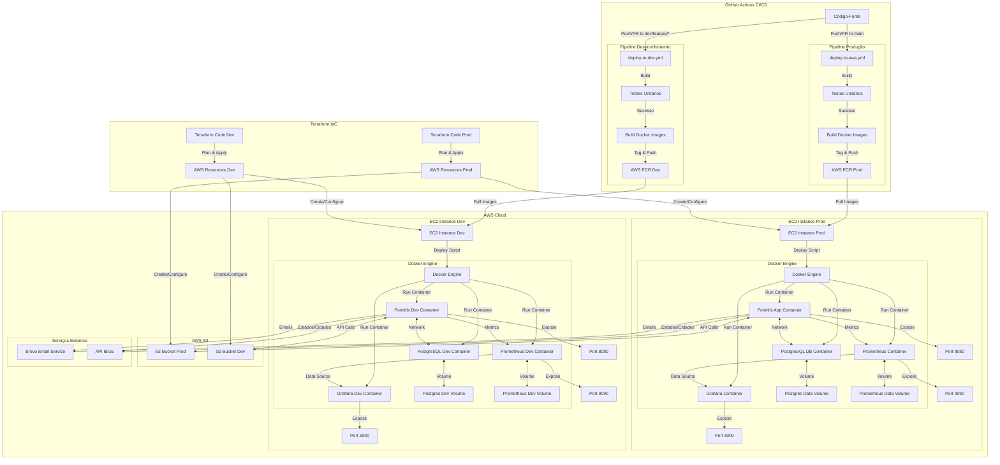

# Diagrama de Deploy Pointtils

## Arquitetura de Infraestrutura e Fluxo de Deploy

## Componentes Detalhados

### Ambientes
- **Produção**: Deploy através do workflow `deploy-to-aws.yml` na branch `main`
- **Desenvolvimento**: Deploy através do workflow `deploy-to-dev.yml` nas branches `dev`, `feature/*`

### Repositórios GitHub
- **Backend**: Contém o código da aplicação Java Spring Boot, Terraform, scripts de deploy e CI/CD workflows

### AWS ECR (Elastic Container Registry)
- **Repositórios**:
  - `pointtils`: Imagens da aplicação para produção
  - `pointtils-db`: Imagens do banco de dados para produção
  - `pointtils-dev`: Imagens da aplicação para desenvolvimento
  - `pointtils-dev-db`: Imagens do banco de dados para desenvolvimento
- **Tags**:
  - `latest`: Imagem mais recente para produção
  - `dev-latest`: Imagem mais recente para desenvolvimento
  - `previous`: Imagem anterior (para rollback)
  - `[commit-sha]`: Tag específica por commit

### AWS EC2
- **Instâncias**:
  - `pointtils-app`: Instância EC2 de produção (t2.medium)
  - `pointtils-dev-app`: Instância EC2 de desenvolvimento (t2.medium)
- **Segurança**:
  - Security Groups: Portas 22 (SSH), 8080 (App), 5432 (PostgreSQL)
  - SSH Key Pair

### Docker Containers
- **Produção**:
  - `pointtils`: Container da aplicação Spring Boot
  - `pointtils-db`: Container do PostgreSQL
  - `prometheus`: Container do Prometheus para monitoramento
  - `grafana`: Container do Grafana para visualização de métricas
- **Desenvolvimento**:
  - `pointtils-dev`: Container da aplicação Spring Boot
  - `pointtils-db-dev`: Container do PostgreSQL
  - `prometheus-dev`: Container do Prometheus para desenvolvimento
  - `grafana-dev`: Container do Grafana para desenvolvimento

### Volumes Docker
- **Produção**:
  - `postgres_data`: Volume para persistência do PostgreSQL
  - `prometheus_data`: Volume para persistência das métricas do Prometheus
- **Desenvolvimento**:
  - `postgres_dev_data`: Volume para persistência do PostgreSQL de desenvolvimento
  - `prometheus_dev_data`: Volume para persistência das métricas do Prometheus de desenvolvimento

### Redes Docker
- **Produção**:
  - `pointtils-network`: Rede para comunicação entre containers
- **Desenvolvimento**:
  - `pointtils-dev-network`: Rede para comunicação entre containers de desenvolvimento

### Portas
- **8080**: Aplicação Spring Boot
- **5432**: PostgreSQL
- **9090**: Prometheus (monitoramento)
- **3000**: Grafana (dashboard de métricas)

### Monitoramento e Observabilidade
- **Prometheus**:
  - **Porta**: 9090
  - **Configuração**: Coleta métricas da aplicação via endpoint `/actuator/prometheus`
  - **Intervalo de Scrape**: 15 segundos
  - **Alertas**: Configurados via `alerts.yml` e `recording_rules.yml`
  - **Métricas Principais**: Status da aplicação, CPU, memória, requisições HTTP, threads, conexões de banco

- **Grafana**:
  - **Porta**: 3000
  - **Dashboard**: "PointTils - Dashboard de Performance"
  - **Data Source**: Prometheus (http://prometheus:9090)
  - **Métricas Monitoradas**:
    - Status da aplicação e utilização de recursos
    - Performance HTTP (vazão, tempo de resposta, status codes)
    - Métricas JVM (memória, threads, garbage collection)
    - Conexões de banco de dados (HikariCP)
    - Taxa de erro e latência

- **Spring Boot Actuator**:
  - **Endpoint**: `/actuator/prometheus`
  - **Métricas Expostas**: Micrometer metrics para JVM, HTTP, banco de dados
  - **Configuração**: Habilitado via dependências Spring Boot Actuator e Micrometer

### AWS S3
- **Buckets**:
  - `pointtils-api-tests-[hash]`: Bucket para testes e armazenamento de imagens (produção)
  - `pointtils-dev-api-tests-[hash]`: Bucket para testes e armazenamento de imagens (desenvolvimento)

### Terraform Backend
- **S3**:
  - `pointtils-terraform-state`: Bucket para estado do Terraform de produção
  - `pointtils-terraform-state-dev`: Bucket para estado do Terraform de desenvolvimento

### Integrações Externas

- **Brevo (Email Service)**:
  - **Provedor**: Brevo (Sendinblue)
  - **Configuração SMTP**:
    - **Host**: `smtp-relay.brevo.com`
    - **Porta**: 587
    - **Autenticação**: TLS habilitado
    - **Templates**: Armazenados no banco de dados
  - **Funcionalidades**:
    - Email de boas-vindas
    - Recuperação de senha
    - Confirmação de agendamento
    - Solicitação de cadastro de intérprete
    - Feedback de aprovação/rejeição

- **API IBGE (Estados e Cidades)**:
  - **Endpoint**: `https://servicodados.ibge.gov.br/api/v1/localidades/`
  - **Funcionalidades**:
    - Lista de estados brasileiros
    - Lista de cidades por estado
    - Dados geográficos para cadastro de usuários
  - **Configuração**:
    - Timeout: 5 segundos
    - RestTemplate customizado
    - Tratamento de exceções específico

## Fluxo de Deploy

### Fluxo de CI/CD (GitHub Actions)

1. **Trigger**:
   - **Produção**: Push/PR para branch `main`
   - **Desenvolvimento**: Push/PR para branches `dev`, `feature/*`

2. **Build e Teste**:
   - Checkout do código
   - Cache das dependências Maven
   - Configuração do JDK 17
   - Execução dos testes unitários

3. **Build e Push de Imagens Docker**:
   - Login no AWS ECR
   - Verificação/criação dos repositórios ECR
   - Criação do arquivo `.env` com variáveis de ambiente
   - Build das imagens usando docker-compose
   - Tag e Push das imagens para o ECR:
     - Tag com SHA do commit
     - Tag `latest`/`dev-latest`
     - Tag `previous` (para rollback)

4. **Deploy da Infraestrutura**:
   - Configuração das credenciais AWS
   - Criação dos recursos de backend do Terraform
   - Execução do Terraform:
     - Init
     - Validate
     - Plan
     - Apply

5. **Deploy da Aplicação**:
   - Obtenção do IP da instância EC2
   - Verificação de disponibilidade do host
   - Cópia e execução do script de deploy na EC2
   - Health check da aplicação

6. **Rollback Automático (em caso de falha)**:
   - Execução do script de rollback para voltar à versão anterior estável

### Fluxo de Deploy na EC2

1. **Preparação**:
   - Login no ECR
   - Pull das imagens mais recentes

2. **Limpeza**:
   - Parada e remoção de containers existentes
   - Remoção forçada de containers caso necessário
   - Verificação e liberação de portas em uso

3. **Inicialização dos Containers**:
   - Inicialização do container do banco de dados
   - Aguardo pelo banco ficar saudável
   - Inicialização do container da aplicação com variáveis de ambiente

4. **Verificação**:
   - Verificação do status dos containers
   - Verificação dos logs da aplicação
   - Health check da API

### Fluxo de Rollback

1. **Trigger**:
   - Falha no deploy
   - Execução manual

2. **Execução**:
   - Pull da imagem com tag `previous`
   - Parada e remoção de containers existentes
   - Inicialização dos containers com a versão anterior
   - Verificação da saúde da aplicação

## Variáveis de Ambiente

### Aplicação
- `SPRING_DATASOURCE_URL`
- `SPRING_DATASOURCE_USERNAME`
- `SPRING_DATASOURCE_PASSWORD`
- `SPRING_APPLICATION_NAME`
- `SERVER_PORT`
- `JWT_SECRET`
- `JWT_EXPIRATION_TIME`
- `JWT_REFRESH_EXPIRATION_TIME`
- `SPRING_JPA_HIBERNATE_DDL_AUTO`
- `SPRING_JPA_SHOW_SQL`
- `SPRING_FLYWAY_ENABLED`
- `SPRING_FLYWAY_LOCATIONS`
- `SPRING_PROFILES_ACTIVE`
- `CLOUD_AWS_BUCKET_NAME`
- `AWS_REGION`
- `AWS_ACCESS_KEY_ID`
- `AWS_SECRET_ACCESS_KEY`

### Banco de Dados
- `POSTGRES_DB`
- `POSTGRES_USER`
- `POSTGRES_PASSWORD`

## Estratégia de Ramificação (Branching)

- **main**: Produção - implantação automática para o ambiente de produção
- **dev**: Desenvolvimento - implantação automática para o ambiente de desenvolvimento
- **feature/\***: Branches de recursos - implantação para ambiente de desenvolvimento via PR para dev

## Scripts

### Deploy
- `terraform/deploy-app.sh`: Deploy para produção
- `terraform-dev/deploy-dev-app.sh`: Deploy para desenvolvimento

### Rollback
- `terraform/rollback-app.sh`: Rollback para produção
- `terraform-dev/rollback-dev-app.sh`: Rollback para desenvolvimento

## Ciclo de Vida dos Recursos

1. **Infraestrutura**: Gerenciada pelo Terraform, com estado armazenado no S3
2. **Containers**: Recriados a cada deploy, enquanto os volumes persistem
3. **Imagens**: Gerenciadas pelo ECR, com política de lifecycle (manter últimas 10)
4. **Dados**: Persistidos através de volumes Docker conectados aos containers
