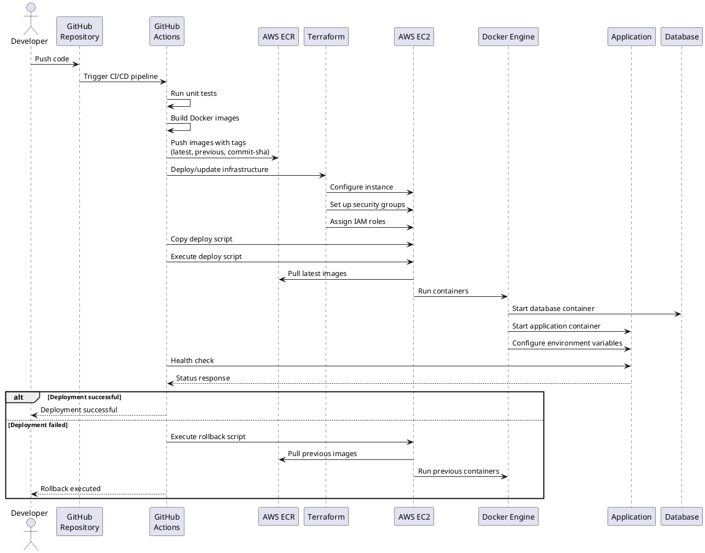

# Diagrama de Deploy Pointtils (PlantUML)

## Arquitetura de Infraestrutura e Fluxo de Deploy

```plantuml
@startuml Pointtils Deployment Architecture

!define AWSPuml https://raw.githubusercontent.com/awslabs/aws-icons-for-plantuml/master/dist
!include AWSPuml/AWSCommon.puml
!include AWSPuml/Compute/EC2.puml
!include AWSPuml/Containers/ElasticContainerRegistry.puml
!include AWSPuml/Storage/SimpleStorageService.puml
!include AWSPuml/SecurityIdentityCompliance/IAM.puml

' Custom components
component "GitHub Actions CI/CD" as CICD {
  [Source Code] as SRC
  [CI/CD Pipeline] as PIPELINE
  [Unit Tests] as TESTS
  [Docker Build] as DOCKERBUILD
}

SRC --> PIPELINE : Push/PR
PIPELINE --> TESTS : Build
TESTS --> DOCKERBUILD : Success
DOCKERBUILD --> ECR : Tag & Push

' AWS Cloud
cloud "AWS Cloud" {
  EC2Instance(ec2, "EC2 Instance", "t2.medium") {
    component "Docker Engine" as DockerEngine {
      [Pointtils App Container] as AppContainer
      [PostgreSQL DB Container] as DBContainer
      database "Postgres Data Volume" as DBVolume

      DockerEngine --> AppContainer : Run
      DockerEngine --> DBContainer : Run
      AppContainer <--> DBContainer : Network
      DBContainer <--> DBVolume : Volume
    }
    AppContainer --> [Port 8080] : Expose
  }
  
  SimpleStorageServiceBucket(s3, "S3 Bucket", "File Storage")
  IAMRole(iamRole, "IAM Role", "EC2 Permissions")
  [Security Groups] as SG
  
  AppContainer <--> s3 : API Calls
  ECR --> ec2 : Pull Images
  iamRole --> ec2 : Permissions
}

' Terraform IaC
component "Terraform IaC" as TerraformIaC {
  [Terraform Code] as TerraformCode
  [AWS Resources] as AWSResources
}

TerraformCode --> AWSResources : Plan & Apply
AWSResources --> ec2 : Create/Configure
AWSResources --> s3 : Create/Configure
AWSResources --> SG : Create/Configure
AWSResources --> iamRole : Create/Configure

@enduml
```

## Deployment Flow Sequence



## Componentes Detalhados

### Ambientes
- **Produção**: Deploy através do workflow `deploy-to-aws.yml` na branch `main`
- **Desenvolvimento**: Deploy através do workflow `deploy-to-dev.yml` nas branches `dev`, `feature/*`

### Repositórios GitHub
- **Backend**: Contém o código da aplicação Java Spring Boot, Terraform, scripts de deploy e CI/CD workflows

### AWS ECR (Elastic Container Registry)
- **Repositórios**:
  - `pointtils`: Imagens da aplicação para produção
  - `pointtils-db`: Imagens do banco de dados para produção
  - `pointtils-dev`: Imagens da aplicação para desenvolvimento
  - `pointtils-dev-db`: Imagens do banco de dados para desenvolvimento
- **Tags**:
  - `latest`: Imagem mais recente para produção
  - `dev-latest`: Imagem mais recente para desenvolvimento
  - `previous`: Imagem anterior (para rollback)
  - `[commit-sha]`: Tag específica por commit

### AWS EC2
- **Instâncias**:
  - `pointtils-app`: Instância EC2 de produção (t2.medium)
  - `pointtils-dev-app`: Instância EC2 de desenvolvimento (t2.medium)
- **Segurança**:
  - Security Groups: Portas 22 (SSH), 8080 (App), 5432 (PostgreSQL)
  - SSH Key Pair

### Docker Containers
- **Produção**:
  - `pointtils`: Container da aplicação Spring Boot
  - `pointtils-db`: Container do PostgreSQL
- **Desenvolvimento**:
  - `pointtils-dev`: Container da aplicação Spring Boot
  - `pointtils-db-dev`: Container do PostgreSQL

### Volumes Docker
- **Produção**:
  - `postgres_data`: Volume para persistência do PostgreSQL
- **Desenvolvimento**:
  - `postgres_dev_data`: Volume para persistência do PostgreSQL de desenvolvimento

### Redes Docker
- **Produção**:
  - `pointtils-network`: Rede para comunicação entre containers
- **Desenvolvimento**:
  - `pointtils-dev-network`: Rede para comunicação entre containers de desenvolvimento


