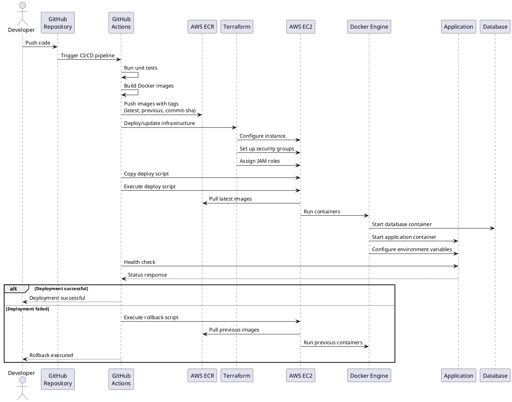

# Diagrama de Deploy Pointtils (PlantUML)

## Arquitetura de Infraestrutura e Fluxo de Deploy

```plantuml
@startuml Pointtils Deployment Architecture

!define AWSPuml https://raw.githubusercontent.com/awslabs/aws-icons-for-plantuml/master/dist
!include AWSPuml/AWSCommon.puml
!include AWSPuml/Compute/EC2.puml
!include AWSPuml/Containers/ElasticContainerRegistry.puml
!include AWSPuml/Storage/SimpleStorageService.puml
!include AWSPuml/SecurityIdentityCompliance/IAM.puml

' Custom components
component "GitHub Actions CI/CD" as CICD {
  [Source Code] as SRC
  
  component "Pipeline Produção" as PROD_PIPELINE {
    [deploy-to-aws.yml] as PROD_WORKFLOW
    [Unit Tests] as PROD_TESTS
    [Docker Build] as PROD_DOCKERBUILD
  }
  
  component "Pipeline Desenvolvimento" as DEV_PIPELINE {
    [deploy-to-dev.yml] as DEV_WORKFLOW
    [Unit Tests] as DEV_TESTS
    [Docker Build] as DEV_DOCKERBUILD
  }
}

SRC --> PROD_PIPELINE : Push/PR to main
SRC --> DEV_PIPELINE : Push/PR to dev/feature/*
PROD_PIPELINE --> PROD_TESTS : Build
PROD_TESTS --> PROD_DOCKERBUILD : Success
PROD_DOCKERBUILD --> ECR : Tag & Push (prod)
DEV_PIPELINE --> DEV_TESTS : Build
DEV_TESTS --> DEV_DOCKERBUILD : Success
DEV_DOCKERBUILD --> ECR : Tag & Push (dev)

' AWS Cloud
cloud "AWS Cloud" {
  EC2Instance(ec2, "EC2 Instance", "t2.medium") {
    component "Docker Engine" as DockerEngine {
      [Pointtils App Container] as AppContainer
      [PostgreSQL DB Container] as DBContainer
      [Prometheus Container] as PrometheusContainer
      [Grafana Container] as GrafanaContainer
      database "Postgres Data Volume" as DBVolume
      database "Prometheus Data Volume" as PrometheusVolume

      DockerEngine --> AppContainer : Run
      DockerEngine --> DBContainer : Run
      DockerEngine --> PrometheusContainer : Run
      DockerEngine --> GrafanaContainer : Run
      AppContainer <--> DBContainer : Network
      DBContainer <--> DBVolume : Volume
      PrometheusContainer <--> PrometheusVolume : Volume
    }
    AppContainer --> [Port 8080] : Expose
    PrometheusContainer --> [Port 9090] : Expose
    GrafanaContainer --> [Port 3000] : Expose
  }
  
  SimpleStorageServiceBucket(s3, "S3 Bucket", "File Storage")
  IAMRole(iamRole, "IAM Role", "EC2 Permissions")
  [Security Groups] as SG
  
  AppContainer <--> s3 : API Calls
  AppContainer --> PrometheusContainer : Metrics (/actuator/prometheus)
  PrometheusContainer --> GrafanaContainer : Data Source
  AppContainer --> Brevo : Email Service
  AppContainer --> IBGE : States & Cities API
  ECR --> ec2 : Pull Images
  iamRole --> ec2 : Permissions
}

' Terraform IaC
component "Terraform IaC" as TerraformIaC {
  [Terraform Code] as TerraformCode
  [AWS Resources] as AWSResources
}

TerraformCode --> AWSResources : Plan & Apply
AWSResources --> ec2 : Create/Configure
AWSResources --> s3 : Create/Configure
AWSResources --> SG : Create/Configure
AWSResources --> iamRole : Create/Configure

@enduml
```

## Deployment Flow Sequence



## Componentes Detalhados

### Ambientes
- **Produção**: Deploy através do workflow `deploy-to-aws.yml` na branch `main`
- **Desenvolvimento**: Deploy através do workflow `deploy-to-dev.yml` nas branches `dev`, `feature/*`

### Repositórios GitHub
- **Backend**: Contém o código da aplicação Java Spring Boot, Terraform, scripts de deploy e CI/CD workflows

### AWS ECR (Elastic Container Registry)
- **Repositórios**:
  - `pointtils`: Imagens da aplicação para produção
  - `pointtils-db`: Imagens do banco de dados para produção
  - `pointtils-dev`: Imagens da aplicação para desenvolvimento
  - `pointtils-dev-db`: Imagens do banco de dados para desenvolvimento
- **Tags**:
  - `latest`: Imagem mais recente para produção
  - `dev-latest`: Imagem mais recente para desenvolvimento
  - `previous`: Imagem anterior (para rollback)
  - `[commit-sha]`: Tag específica por commit

### AWS EC2
- **Instâncias**:
  - `pointtils-app`: Instância EC2 de produção (t2.medium)
  - `pointtils-dev-app`: Instância EC2 de desenvolvimento (t2.medium)
- **Segurança**:
  - Security Groups: Portas 22 (SSH), 8080 (App), 5432 (PostgreSQL)
  - SSH Key Pair

### Docker Containers
- **Produção**:
  - `pointtils`: Container da aplicação Spring Boot
  - `pointtils-db`: Container do PostgreSQL
  - `prometheus`: Container do Prometheus para monitoramento
  - `grafana`: Container do Grafana para visualização de métricas
- **Desenvolvimento**:
  - `pointtils-dev`: Container da aplicação Spring Boot
  - `pointtils-db-dev`: Container do PostgreSQL
  - `prometheus-dev`: Container do Prometheus para desenvolvimento
  - `grafana-dev`: Container do Grafana para desenvolvimento

### Volumes Docker
- **Produção**:
  - `postgres_data`: Volume para persistência do PostgreSQL
  - `prometheus_data`: Volume para persistência das métricas do Prometheus
- **Desenvolvimento**:
  - `postgres_dev_data`: Volume para persistência do PostgreSQL de desenvolvimento
  - `prometheus_dev_data`: Volume para persistência das métricas do Prometheus de desenvolvimento

### Redes Docker
- **Produção**:
  - `pointtils-network`: Rede para comunicação entre containers
- **Desenvolvimento**:
  - `pointtils-dev-network`: Rede para comunicação entre containers de desenvolvimento

### Monitoramento e Observabilidade
- **Prometheus**:
  - **Porta**: 9090
  - **Configuração**: Coleta métricas da aplicação via endpoint `/actuator/prometheus`
  - **Intervalo de Scrape**: 15 segundos
  - **Alertas**: Configurados via `alerts.yml` e `recording_rules.yml`
  - **Métricas Principais**: Status da aplicação, CPU, memória, requisições HTTP, threads, conexões de banco

- **Grafana**:
  - **Porta**: 3000
  - **Dashboard**: "PointTils - Dashboard de Performance"
  - **Data Source**: Prometheus (http://prometheus:9090)
  - **Métricas Monitoradas**:
    - Status da aplicação e utilização de recursos
    - Performance HTTP (vazão, tempo de resposta, status codes)
    - Métricas JVM (memória, threads, garbage collection)
    - Conexões de banco de dados (HikariCP)
    - Taxa de erro e latência

- **Spring Boot Actuator**:
  - **Endpoint**: `/actuator/prometheus`
  - **Métricas Expostas**: Micrometer metrics para JVM, HTTP, banco de dados
  - **Configuração**: Habilitado via dependências Spring Boot Actuator e Micrometer

### Integrações Externas

- **Brevo (Email Service)**:
  - **Provedor**: Brevo (Sendinblue)
  - **Configuração SMTP**:
    - **Host**: `smtp-relay.brevo.com`
    - **Porta**: 587
    - **Autenticação**: TLS habilitado
    - **Templates**: Armazenados no banco de dados
  - **Funcionalidades**:
    - Email de boas-vindas
    - Recuperação de senha
    - Confirmação de agendamento
    - Solicitação de cadastro de intérprete
    - Feedback de aprovação/rejeição

- **API IBGE (Estados e Cidades)**:
  - **Endpoint**: `https://servicodados.ibge.gov.br/api/v1/localidades/`
  - **Funcionalidades**:
    - Lista de estados brasileiros
    - Lista de cidades por estado
    - Dados geográficos para cadastro de usuários
  - **Configuração**:
    - Timeout: 5 segundos
    - RestTemplate customizado
    - Tratamento de exceções específico

